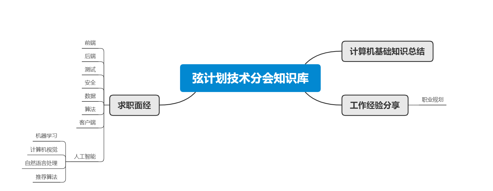

# String-Plan
Find us at https://project-string.github.io/ProjectString/

# knowledge Base

## Project String Tech Outline

## Template
- Paste your own blog under `_posts`
- Rules & Principles
    - First, please name your blog with the key point
    - Second, please choose some topics based on our **Project String Tech Outline** above. 
        - Pls: If you found we don't have the related topic in our outline, feel free to write down in your PR, and let me do the update.
    - Third, please check the template which I have created before.[Mini Program Learning Resources](_posts\Mini-Program-Learning-Resources.md)
        - Notice: Please remember to fill in **title, date, description, categories**. The **categories** is what you have chosed based on our ouline in the second step.